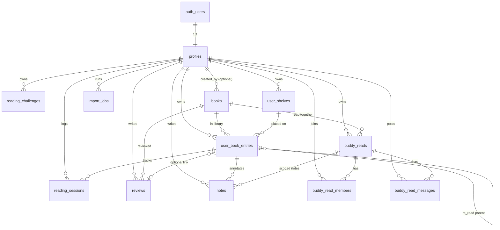

# DiLibris — модель даних

Документація до `supabase/migrations/001_initial_schema.sql`. Backend: Supabase (Postgres + Auth + RLS).

---

## ER-діаграма



---

## Розширення

| Розширення | Призначення |
|------------|-------------|
| `pgcrypto` | `gen_random_bytes` для `invite_token`, UUID |
| `pg_trgm` | Нечіткий пошук за назвою книги (`title`) |

---

## Таблиці

### `profiles`

Профіль користувача, створюється тригером `handle_new_user` після реєстрації в `auth.users`.

| Поле | Опис |
|------|------|
| `id` | UUID, збігається з `auth.users.id` |
| `display_name` | Ім’я в UI |
| `avatar_url`, `bio` | Публічний профіль |
| `locale` | За замовчуванням `uk` |
| `is_profile_public` | Чи видно профіль іншим |

**RLS:** читання — свій або публічний; зміна — лише свій.

---

### `reading_challenges`

Річні або власні цілі читання (кількість книг, сторінок, хвилин).

| Поле | Опис |
|------|------|
| `year`, `title` | Унікальність разом з `user_id` |
| `target_books`, `target_pages`, `target_minutes` | Цілі |
| `starts_on`, `ends_on` | Опційний період |

**RLS:** повністю приватні для власника. У статистику потрапляють записи `user_book_entries` з `counts_toward_stats = true`.

---

### `books`

Спільний каталог книг (не прив’язаний до одного користувача).

| Поле | Опис |
|------|------|
| `title`, `authors`, `isbn_*` | Метадані |
| `external_ids` | **JSONB** — ключі зовнішніх API (`open_library`, `google_books`, …) |
| `cover_url`, `page_count` | Для полиць і картки |
| `created_by` | Хто додав вручну (опційно) |

**RLS:** `SELECT` для всіх; `INSERT`/`UPDATE` для автентифікованих (оновлення — лише автор запису).

---

### `user_shelves`

Віртуальні полиці в «кімнаті» бібліотеки.

| Поле | Опис |
|------|------|
| `name`, `sort_order` | Відображення |
| `status_filter` | Опційно: полиця лише для певного `book_entry_status` |
| `color`, `icon` | Оформлення |

**RLS:** лише власник.

---

### `user_book_entries`

Зв’язок «користувач ↔ книга» — серце трекера.

| Поле | Опис |
|------|------|
| `status` | `want_to_read` · `reading` · `finished` · `dnf` · `re_reading` |
| `rating` | **0.5–5** з кроком 0.5 (півзірки) |
| `counts_toward_stats` | Чи враховувати в challenge / дашборді (важливо для перечитань) |
| `format` | `paper` · `ebook` |
| `started_on`, `finished_on`, `current_page`, `total_pages` | Прогрес |
| `total_minutes` | Сума з `reading_sessions` (тригер `sync_entry_total_minutes`) |
| `parent_entry_id` | Для `re_reading` — посилання на попередній запис |
| `is_entry_public` | Публічна видимість у `book_readers_public` |
| `shelf_id` | На якій полиці стоїть книга |

**RLS:** власник бачить усе; інші — лише `is_entry_public = true`.

---

### `reading_sessions`

Окремі сесії читання (сторінки, хвилини, нотатка до сесії).

| Поле | Опис |
|------|------|
| `entry_id` | Запис бібліотеки |
| `minutes`, `pages_read` | Прогрес сесії |

**Тригер:** після insert/update/delete оновлює `user_book_entries.total_minutes`.

**RLS:** лише власник запису.

---

### `active_reading_sessions`

Чернетка **активної** сесії (таймер ще не завершено). Один рядок на користувача; синхронізується між пристроями через Supabase Realtime. Видаляється після «Завершити й записати» або «Скасувати».

| Поле | Опис |
|------|------|
| `user_id` | PK — один активний таймер на акаунт |
| `entry_id` | Книга, яку зараз читають |
| `accumulated_seconds` | Накопичений час (оновлюється на паузі / autosave) |
| `is_running` | Чи тікає таймер зараз |
| `last_tick_at` | Останній sync running-часу |
| `pages_draft`, `note_draft` | Чернетка полів форми |

**RLS:** лише власник. Міграція: `003_active_reading_sessions.sql`.

---

### `reviews`

Текстовий відгук + рейтинг; за продуктом **завжди публічний**.

| Поле | Опис |
|------|------|
| `body`, `rating` | Обов’язковий рейтинг 0.5–5 |
| `entry_id` | Опційний зв’язок із конкретним проходженням |
| `contains_spoilers` | Прапорець спойлерів |

**RLS:** читання для всіх (включно з `anon`); запис — лише автор.

---

### `notes`

Цитати, думки, загальні нотатки; приватні або публічні; можуть бути прив’язані до buddy read.

| Поле | Опис |
|------|------|
| `note_type` | `quote` · `thought` · `general` |
| `visibility` | `private` · `public` |
| `buddy_read_id` | **FK** на `buddy_reads` — нотатки в контексті спільного читання |
| `page_number`, `chapter` | Прив’язка до місця в книзі |
| `contains_spoilers` | Спойлери |

**RLS (розділені політики SELECT):**

- власні нотатки;
- `visibility = public`;
- нотатки з `buddy_read_id`, якщо користувач — учасник (`is_buddy_read_member`).

**INSERT / UPDATE / DELETE:** лише власник.

---

### `buddy_reads`

Спільне читання з запрошенням по посиланню.

| Поле | Опис |
|------|------|
| `invite_token` | Унікальний токен для RPC `join_buddy_read(token)` |
| `owner_id`, `book_id`, `title` | Організатор і книга |
| `target_finish_on`, `is_archived` | Дедлайн і архів |

Після створення власник автоматично додається в `buddy_read_members` з роллю `owner`.

**RLS:** бачать лише учасники; змінює лише `owner`.

---

### `buddy_read_members`

Учасники групи.

| Поле | Опис |
|------|------|
| `role` | `owner` · `member` |

Приєднання через **`join_buddy_read(p_token)`** (security definer, `authenticated`).

---

### `buddy_read_messages`

Повідомлення в чаті buddy read.

**RLS:** читання/написання — лише учасники; редагування/видалення — автор повідомлення.

---

### `import_jobs`

Черга імпорту (наприклад Goodreads CSV у майбутніх версіях).

| Поле | Опис |
|------|------|
| `source` | `goodreads_csv` · `manual_batch` |
| `status` | `pending` → `processing` → `completed` / `failed` |
| `processed_rows`, `result_summary` | Прогрес і підсумок |

**RLS:** лише власник job.

---

## Представлення

### `book_readers_public`

Публічне «хто читав цю книгу»: профілі з `is_profile_public`, записи з `is_entry_public` або наявний `review`, статуси `finished` / `re_reading`. Використовується для соціального шару без витоку приватної бібліотеки.

---

## Функції та тригери

| Ім’я | Тип | Опис |
|------|-----|------|
| `set_updated_at` | trigger | `profiles`, `user_shelves`, `user_book_entries`, `reviews`, `notes`, `reading_challenges` |
| `handle_new_user` | trigger on `auth.users` | Створює `profiles` |
| `sync_entry_total_minutes` | trigger on `reading_sessions` | Перераховує `total_minutes` |
| `is_buddy_read_member` | SQL helper | Для RLS нотаток і buddy read |
| `join_buddy_read` | RPC | Приєднання за `invite_token` |

---

## Статуси та обмеження (шпаргалка)

```
book_entry_status: want_to_read | reading | finished | dnf | re_reading
rating: 0.5, 1.0, 1.5, … 5.0
note_type: quote | thought | general
note_visibility: private | public
```

---

## Застосування міграції

1. Новий проєкт у [Supabase Dashboard](https://supabase.com/dashboard).
2. SQL Editor → вставити вміст `001_initial_schema.sql` → Run.
3. Увімкнути Magic Link у Authentication.

Деталі продукту: [product-spec.md](product-spec.md).
